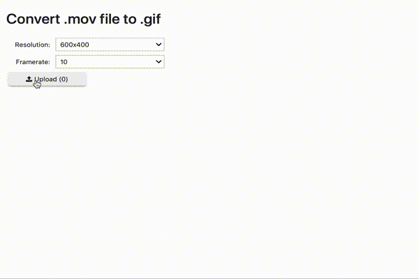

# pymov2gif
Convert `*.mov` to `*.gif`:

## Web Interface 
[](https://mybinder.org/v2/gh/jan-janssen/pymov2gif/main?urlpath=/voila/render/app.ipynb)

 

## Python Interface 
To integrate the functionality in your project, just import the `convert` function: 
```
from pymov2gif import convert
convert(file, resolution='800x600', framerate=10, output_file=None)
```

* file (str): Input movie file in *.mov format 
* resolution (str): Resolution of the output *.gif file - default: 800x600
* framerate (int): Framerate of the output *.gif file - default: 10
* output_file (str/None): Filename of the output *.gif file - optional 

## Comand Line Interface 
Quickly convert your *.mov files to the *.gif format on the command line: 
```
pymov2gif test.mov --resolution=800x600 --framerate=10 --output_filename=test.gif
```

* `test.mov`: Input movie file in *.mov format 
* `--resolution`: Resolution of the output *.gif file - default: 800x600
* `--framerate`: Framerate of the output *.gif file - default: 10
* `--output_filename`: Filename of the output *.gif file - optional 

## Installation 
Both the python interface and the command line interface require `pymov2gif` to be installed via `pip`:
```
pip install pymov2gif
```
Alternatively, `pymov2gif` can be installed using conda-forge:
```
conda -c conda-forge pymov2gif
```
